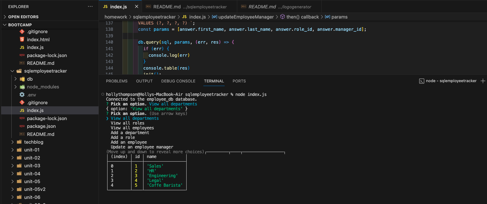
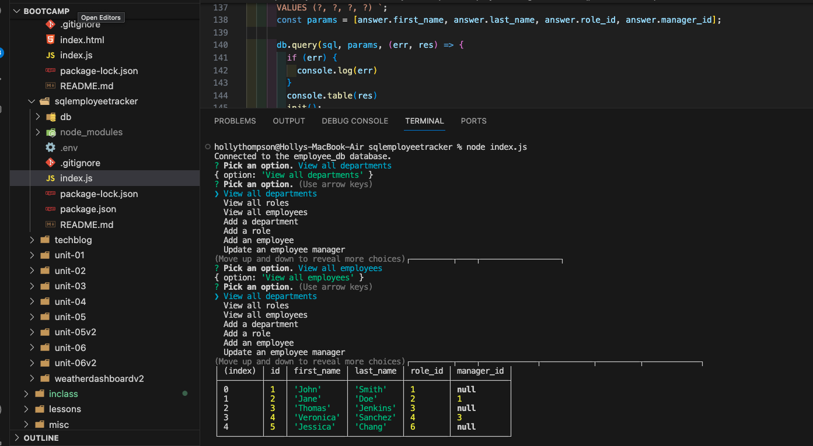

#  Employee Database

## Description

A user friendly app to view the employee database. The user needs to follow the prompts to view departments, add new employees, add new roles and update managers.

## How to Use

You can quickly and easily view the employee database file by using the command-line application to create one. 

## Link to github
https://github.com/thompsonholly/sqlemployeetracker

## Video Walkthrough

https://watch.screencastify.com/v/qS7kFSQ5liGcN8SNMWmL to an external site.
